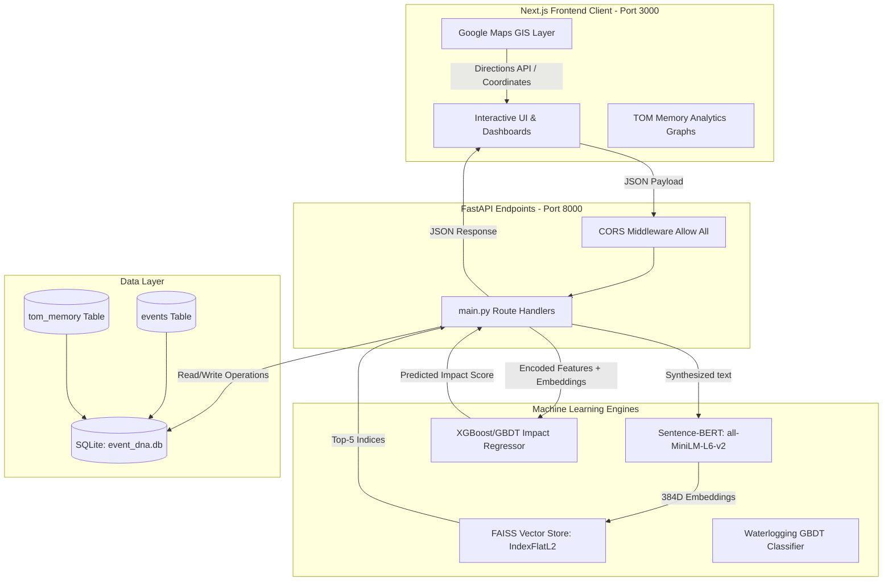

# CORTEX AI: Technical Architecture Document

This document provides a detailed breakdown of the technical and machine learning architecture of the **CORTEX AI** (Congestion Operations and Traffic Response Expert) platform. It covers data flow, the ML pipeline, vector search, database structures, and the detailed architecture of all 11 prototype modules.

---

## 1. Global Architecture Overview

CORTEX AI employs a hybrid client-server topology. The **Next.js frontend** provides interactive spatial overlays and operational dashboards. The **FastAPI backend** manages resource-intensive AI pipelines (dense transformer inference, multi-dimensional regression, and vector similarity search) and maintains state persistence in an SQLite database.



---

## 2. Machine Learning Pipeline Architecture

The primary machine learning pipeline of CORTEX AI operates on a **multimodal late-fusion paradigm**, combining categorical and spatial features with natural language context.

### A. Semantic Synthesis & Sentence-BERT Engine
*   **Purpose**: Standardize unstructured incident parameters into clean text formats and project them into a semantic vector space.
*   **Mechanism**:
    1.  The backend compiles metadata parameters (cause, type, zone, priority, and road closure state) using string interpolation:
        ```python
        f"A {priority} priority {event_type} {event_cause} in {zone} zone at {junction} underpass. Estimated duration: {duration} mins."
        ```
    2.  This synthesized description is encoded by the `all-MiniLM-L6-v2` Sentence-BERT model (a distilled transformer checkpoint optimized for semantic text similarity).
    3.  **Output**: A $1 \times 384$ dense floating-point array (embedding vector) representing the semantic footprint of the event.

### B. FAISS Vector Search Index
*   **Purpose**: Execute sub-millisecond similarity lookups over historical incident profiles.
*   **Mechanism**:
    1.  CORTEX loads the pre-trained FAISS flat index (`event_dna.index`) containing historical S-BERT embeddings.
    2.  For any incoming event, the new S-BERT vector is queried against the index using an **L2 Euclidean Distance** metric:
        $$d(\mathbf{u}, \mathbf{v}) = \sqrt{\sum_{i=1}^{n} (u_i - v_i)^2}$$
    3.  **Output**: The database IDs and similarity metrics of the top 5 closest matched historical incidents, enabling historical case analysis.

### C. Hybrid GBDT Impact Regressor
*   **Purpose**: Forecast the exact `impact_score` ($0.0 - 100.0$) representing predicted traffic delay and queue length.
*   **Mechanism**:
    1.  **Tabular Pipeline**: Encodes categorical values (`event_cause`, `event_type`, `zone`, `priority`) using pre-fit Label Encoders and normalizes spatial coordinates and expected duration.
    2.  **Concatenation**: Fuses the scaled tabular vector ($1 \times 12$) with the dense S-BERT text embedding ($1 \times 384$), forming a unified $1 \times 396$ feature array.
    3.  **Regressor Model**: A Gradient Boosting Decision Tree (GBDT) model predicts the continuous score.
    4.  **Output**: Float value representing the impact percentage.

### D. Underpass Waterlogging GBDT Classifier
*   **Purpose**: Predict active flood hazards at critical low-lying roads.
*   **Mechanism**:
    1.  Ingests current weather telemetry: cumulative 3-hour rainfall ($mm$), peak hourly intensity ($mm/hr$), and physical drainage status (`drain_blockage_flag`).
    2.  Passes these features into a pre-trained Gradient Boosting Classifier model (`waterlogging_model.joblib`).
    3.  **Output**: Binary prediction probability. If probability $> 0.50$, CORTEX flags the underpass as flooded (`is_flooded = 1`), triggering automatic emergency alerts.

---

## 3. Detailed Feature Architectures

CORTEX AI’s Next.js frontend implements 11 specialized dashboards. Below is the operational architecture for each module:

### 1. Command Center
*   **Mechanism**: Main incident ingestion pane. The form captures structured inputs, triggers backend predictions, and lists active events.
*   **API Interaction**:
    *   `POST /api/events`: Submits event schema. The backend generates the S-BERT embedding, queries FAISS, runs the GBDT impact regressor, saves the record to SQLite, and returns the computed impact score and suggested resources.

### 2. CORTEX Explorer
*   **Mechanism**: Visualizes S-BERT vector encodings to explain how CORTEX AI "interprets" raw incident context.
*   **Visuals**: Renders a vector grid where each cell's opacity and color (Indigo/Cyan for positive, Gray/Slate for negative values) correspond to specific float coordinates in the 384-dimensional space.

### 3. Impact Radius GIS Map
*   **Mechanism**: Maps physical blockages and computes geofenced buffers.
*   **GIS Engine**:
    *   Draws incident coordinate circles. The radius scales relative to the calculated impact score:
        $$\text{Radius} = \text{Impact Score} \times 10\text{ meters}$$
    *   Leverages Leaflet/Mapbox markers to highlight coordinates, providing visual telemetry of affected zones.

### 4. Diversion Optimizer
*   **Mechanism**: Computes dynamic detour routes around blocked segments.
*   **Internal Engine**:
    *   Receives incident latitude and longitude.
    *   Calls the Google Maps Directions API to fetch the primary path and alternative detour paths, avoiding the blocked segment coordinate.
    *   Calculates Travel Time Saved and Delay Avoided metrics using historical segment speeds.

### 5. Officer Management
*   **Mechanism**: Dynamic human resource assignment.
*   **Geospatial Logic**:
    *   Computes proximity between the incident coordinate ($lat_{inc}, lon_{inc}$) and all active officer telemetry ($lat_{off}, lon_{off}$) using the **Haversine formula**:
        $$d = 2R \arcsin\left(\sqrt{\sin^2\left(\frac{\Delta lat}{2}\right) + \cos(lat_{inc})\cos(lat_{off})\sin^2\left(\frac{\Delta lon}{2}\right)}\right)$$
    *   Filters officers by availability, returning ETAs and distances.

### 6. Log Outcomes & Learn
*   **Mechanism**: The validation endpoint of the platform's self-learning architecture.
*   **Mechanism**:
    *   Operators record actual incident durations and resources used.
    *   Calculates prediction error (residual):
        $$\text{Residual} = |\text{Predicted Score} - \text{Actual Score}|$$
    *   Saves the validation telemetry to SQLite to adjust model accuracy curves.

### 7. Traffic Operations Memory (TOM)
*   **Mechanism**: Audits learning metrics and lists resolved events.
*   **API Endpoints**:
    *   `GET /api/tom/logs`: Fetches the history of predicted vs actual metrics.
    *   `DELETE /api/tom/logs/{id}`: Deletes validation logs to clean up data noise.

### 8. Zone Risk Intelligence
*   **Mechanism**: Visualizes traffic risks across Bangalore's BBMP zones.
*   **Mechanism**:
    *   Queries historical database records grouped by Zone.
    *   Displays current risk levels (Low, Medium, High, Critical) based on cumulative incidents.

### 9. Post Event Analytics
*   **Mechanism**: Aggregates operational performance metrics.
*   **UI Components**:
    *   Recharts bar and line graphs showing the count of incidents handled, average success ratings, resource distributions, and MAE error reductions.

### 10. Astram Feed Simulator
*   **Mechanism**: Simulates real-time streaming traffic feeds.
*   **Data Stream**:
    *   Streams rows from the anonymized Astram incident dataset.
    *   Visualizes the queue as it steps through text compilation, S-BERT encoding, FAISS matching, and GBDT predictions.

### 11. Waterlogging Alerts
*   **Mechanism**: Real-time underpass flooding predictor.
*   **API Endpoints**:
    *   `POST /api/waterlogging/predict`: Receives simulation parameters (rainfall, intensity, blockage) and returns predictions for Majestic, Hebbal, Silk Board, Richmond, and Tagore circles.

---

## 4. Database Schema (SQLite)

CORTEX AI stores its operational and validation data in `event_dna.db` across three primary tables:

### A. `events` Table
Stores incident details, ML predictions, and calculated GIS statistics:
*   `id` (INTEGER, Primary Key)
*   `event_cause` (TEXT), `event_type` (TEXT), `zone` (TEXT), `junction` (TEXT)
*   `latitude` (REAL), `longitude` (REAL)
*   `priority` (TEXT), `requires_road_closure` (INTEGER)
*   `duration` (REAL), `impact_score` (REAL), `risk_level` (TEXT)
*   `generated_description` (TEXT), `live_traffic_snapshot` (TEXT)
*   `outcome` (TEXT - "Active" or "Resolved")

### B. `tom_memory` Table
Stores post-event validation feedback:
*   `id` (INTEGER, Primary Key)
*   `event_id` (INTEGER, Foreign Key referencing `events.id`)
*   `actual_duration` (REAL)
*   `actual_officers` (INTEGER), `actual_patrols` (INTEGER), `actual_barricades` (INTEGER)
*   `success_rating` (INTEGER), `feedback_notes` (TEXT)
*   `logged_at` (TEXT)

### C. `metrics` Table
Stores rolling performance statistics:
*   `id` (INTEGER, Primary Key)
*   `timestamp` (TEXT)
*   `mean_absolute_error` (REAL)
*   `total_incidents` (INTEGER)
*   `success_rate` (REAL)
