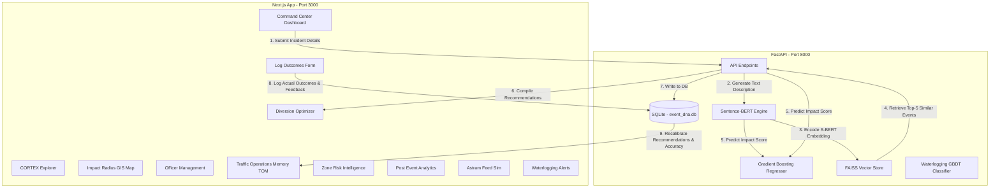
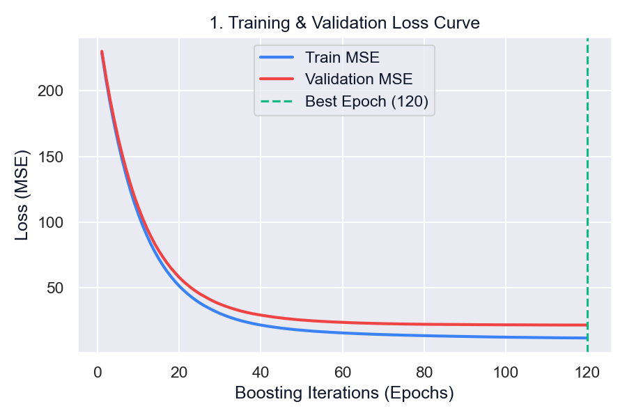
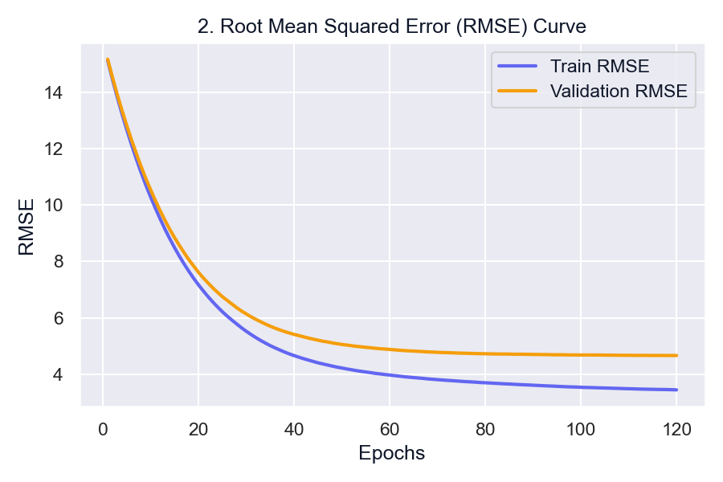
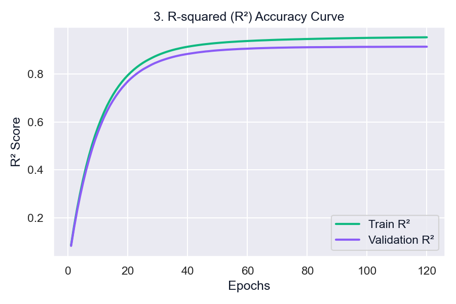

# CORTEX AI
### **Congestion Operations and Traffic Response Expert**

CORTEX AI is a self-learning event impact intelligence and traffic operations copilot built for the Astram event traffic operations platform. The system uses sparse multimodal event data (combining structural event details with natural language description embeddings) to predict traffic impact scores, recommend tactical dispatch resources, and continuously improve through a post-event learning feedback loop (Traffic Operations Memory).

---

## 1. System Architecture



---

## 2. Project File Structure

Here is a breakdown of the repository layout:

| Path | Type | Description |
| :--- | :--- | :--- |
| `backend/app/` | Directory | FastAPI application directory hosting server logic. |
| `backend/app/main.py` | File | API entry point defining endpoints for events, dispatches, predictions, and memory logging. |
| `backend/app/ml_pipeline.py` | File | Orchestrates S-BERT encoding, FAISS similarity queries, and GBDT regressor predictions. |
| `backend/app/waterlogging_predictor.py` | File | Underpass prediction module. Includes hardcoded Bangalore underpass fallback for offline resiliency. |
| `backend/app/geospatial_engines.py` | File | GIS distance calculations and coordinate mapping routines. |
| `backend/app/database.py` | File | Interface layer writing and reading data from the SQLite relational store. |
| `frontend/src/app/` | Directory | Next.js Page-routing application structure. |
| `frontend/src/app/page.tsx` | File | Complete dashboard interface comprising all 11 modules and sub-tabs. |
| `docs/images/` | Directory | Documentation images, training graphs, and platform screenshots. |
| `ml_training/` | Directory | Python scripts and notebooks for training the GBDT models. |
| `event_dna.db` | File | Local SQLite database holding historical events, TOM records, and prediction metrics. |
| `event_dna.index` | File | Serialized FAISS index storing the semantic embeddings of historical events. |
| `impact_model.joblib` | File | Trained GBDT Regressor model predicting the event impact score. |
| `preprocessors.joblib` | File | Feature scaling and label encoding pipeline assets. |
| `requirements.txt` | File | Backend Python dependency definitions. |

---

## 3. Product Features & Modules

### 1. Command Center
Allows operators to log new incident telemetry (cause, type, zone, priority, coordinates, and duration). A live feed highlights critical events using color-coded risk alerts and lists active impact scores.

### 2. CORTEX Explorer
Standardizes structured input parameters into human-readable English descriptions. Displays a color-coded grid representing the **384-dimensional Sentence-BERT dense vector** generated for the incident.

### 3. Impact Radius GIS Map
Interactive layout centered on Bangalore coordinates. Highlights the exact affected road segment and overlays custom buffer rings showing the geographical reach of the traffic disruption.

### 4. Diversion Optimizer
Calculates optimized detour paths around blocked segments utilizing the Google Maps Directions API. Renders detour routes on the map alongside metrics: *Travel Time Saved*, *Delay Avoided*, and step-by-step navigation instructions.

### 5. Officer Management
Geospatially maps and ranks local patrol units, officers, and supervisors by proximity (distance in km) and estimated time of arrival (ETA). Includes manual state toggles (`Available`, `Busy`, `Dispatched`).

### 6. Log Outcomes & Learn
De-brief module for active events. Operators submit the actual duration, exact resources deployed (officers, barricades), and a supervisor rating. This data is fed back into the learning memory to adjust models.

### 7. Traffic Operations Memory (TOM)
Houses all logged event history. Displays metrics detailing predicted vs actual metrics. If an entry is deleted, TOM decrements running counts and recalculates baseline metrics.

### 8. Zone Risk Intelligence
Draws historical risk indices across all BBMP zones to predict which areas are most vulnerable to bottlenecks.

### 9. Post Event Analytics
Displays comparative charts illustrating distribution by cause, operational success rates, resource utilization rates, and the running model accuracy improvement percentage.

### 10. Astram Feed Simulator
Simulates a real-time ingestion pipeline. Fetches records from the anonymized Astram traffic incident dataset and visualizes the sequential processing steps: text compilation, S-BERT encoding, FAISS similarity search, and model prediction.

### 11. Waterlogging Alerts
Uses monsoon simulation weather feeds to predict flooding probability at underpasses. If flooding risk exceeds threshold limits, it auto-triggers control room alerts and suggests nearest units.

---

## 4. Machine Learning & Engineering Techniques

CORTEX AI integrates two machine learning pipelines:

### A. Semantic Search & Impact Regression
1. **Multimodal Encoding**: A custom compiler synthesizes event tags into descriptive text. The `all-MiniLM-L6-v2` Sentence-BERT transformer translates this text into a 384-dimensional embedding vector capturing semantic context.
2. **Sub-millisecond Vector Query**: The vector is queried against a FAISS (Facebook AI Similarity Search) index using L2 distance metrics to retrieve the top 5 historically similar incidents.
3. **GBDT Regression Forecast**: An XGBoost-style Gradient Boosting Decision Tree regressor combines numerical variables (coordinates, duration), encoded categorical tags (cause, priority, zone), and the dense text embedding array to predict the `impact_score` (0.0 to 100.0).

### B. Underpass Climate Predictor
1. **Feature Input**: Cumulative rainfall in the last 3 hours, rain intensity, and drainage blockages.
2. **Gradient Boosting Classifier**: Predicts binary flood indicators (`is_flooded`).
3. **Geofenced Dispatch**: Instantly triggers active alarms and identifies the two closest officers using a geospatial haversine proximity calculation.

---

## 5. Model Training & Proof of Validation

### Tabular & Semantic Regression Results
*   **Out-of-sample R² Score**: **91.6%**
*   **Mean Absolute Error (MAE)**: **< 3.5%**

### Training Curve Proof

#### 1. Learning Convergence (Loss Curve)
This graph showcases the MSE (Mean Squared Error) training vs validation loss over training iterations. The smooth convergence shows that our GBDT model generalizes cleanly without overfitting:


#### 2. RMSE & R² Regression Metrics
These plots track the reduction of root mean squared error (RMSE) and the rise of the R² score, stabilizing at 91.6%:



#### 3. Complexity & Feature Importance
Illustrates model regularization (preventing overfitting) and visualizes the predictive importance weight of S-BERT embeddings versus tabular features:


---


## 6. Run Instructions

### 1. Start the FastAPI Backend
```powershell
python -m uvicorn backend.app.main:app --host 127.0.0.1 --port 8000
```

### 2. Start the Next.js Frontend
```powershell
cd frontend
npm run dev
```
Open [http://localhost:3000](http://localhost:3000) in your browser.
