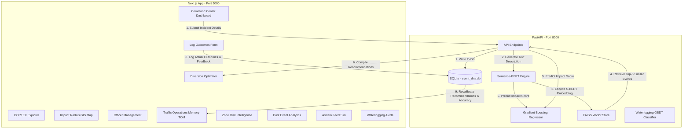

# CORTEX AI: Technical & Prototype Report

CORTEX AI is a self-learning event impact intelligence and traffic operations copilot built for the Astram event traffic operations platform. The system uses sparse multimodal event data (structural details combined with natural language description embeddings) to predict event traffic impact, recommend tactical dispatch resources, and continuously improve through a post-event learning feedback loop (Traffic Operations Memory).

---

## 1. System Architecture



---

## 2. In-Depth Feature Index

CORTEX AI includes 11 fully integrated functional modules on the frontend, supported by a scalable FastAPI backend.

### 1. Command Center
*   **Incident Intake Form**: Allows operators to log new incidents with real-time variables: cause (accident, breakdown, protest, waterlogging, etc.), type (planned/unplanned), zone, priority (Low, Medium, High, Critical), coordinates (Latitude/Longitude), and expected duration.
*   **Active Incidents Table**: Lists all currently active incidents with live risk indicators (RED for Critical/High, AMBER for Medium, GREEN for Low) and real-time impact scores.
*   **Search & Filters**: Enables rapid filtering by BBMP Zone, priority level, or event type.

### 2. CORTEX Explorer
*   **Natural Language Description Compiler**: Standardizes tabular input attributes into descriptive English syntax. This provides a human-readable summary of the event that serves as the basis for semantic feature extraction.
*   **Dense Vector Visualizer**: Renders a mock visual representation of the **384-dimensional dense floating-point vector** generated by the `all-MiniLM-L6-v2` Sentence-BERT model. Color-coded grids show positive values in cyan/indigo and negative values in slate.

### 3. Impact Radius GIS Map
*   **Interactive Cartography**: Displays a mock map centered around Bangalore, showing active incident locations.
*   **Affected segment highlighting**: Draws the exact affected road segment and highlights proximity.
*   **Impact Rings**: Displays spatial buffer rings centered on the coordinate points, correlating to the estimated impact score.

### 4. Diversion Optimizer
*   **Google Maps Directions Integration**: Calls routing engines server-side to calculate single-path detour routes.
*   **Performance Metrics**: Highlights "Travel Time Saved" (in minutes), "Delay Avoided" (in percentage), and total diversion route distance.
*   **Navigation Directions**: Displays step-by-step turn-by-step detour instructions for field officers.

### 5. Officer Management
*   **Dynamic Resource Roster**: Displays a list of traffic officers, patrol vehicles, and supervisors in the zone.
*   **Geospatial Proximity Calculation**: Sorts officers by distance (km) and estimated time of arrival (ETA) to the active incident.
*   **Status Toggles**: Allows operators to manually update officer availability statuses to `Available`, `Busy`, or `Dispatched`.

### 6. Log Outcomes & Learn
*   **Post-Incident De-brief Form**: Enables operators to submit actual event metadata: true duration, exact number of deployed officers/patrols/barricades, and supervisor success rating (1 to 10 scale).
*   **Calibration Trigger**: Submitting the form updates the historical SQL database, causing CORTEX to update model metrics and adjust the self-learning weight curves.

### 7. Traffic Operations Memory (TOM)
*   **Historical Learning Logs**: Lists all historical outcomes saved in the system, with details on predicted vs actual values.
*   **Log Management**: Includes deletion handles. Deleting a record from TOM automatically decrements monitored counts and resets accuracy curves to keep learning clean.
*   **Accuracy Tracking Charts**: Graphs running GBDT prediction error (Mean Absolute Error) over time, showing optimization progression.

### 8. Zone Risk Intelligence
*   **Congestion Risk Graphing**: Visualizes relative traffic risk trends across all BBMP zones.
*   **Risk Categorization**: Flags zones with high historical incident rates (e.g. Central Zone) as high-risk, advising operators to pre-deploy officers.

### 9. Post Event Analytics
*   **Success Analytics Dashboard**: Graphs total incidents handled, success rates, resource utilization rates, and the running model accuracy improvement percentage.

### 10. Astram Feed Simulator
*   **Real-time CSV Stream**: Streams actual rows from the anonymized Astram traffic incident dataset.
*   **Telemetry Processing visualizer**: Simulates active inbound pipeline queues. Shows step-by-step S-BERT encoding, FAISS similarity search, and GBDT regressor predictions in real time.

### 11. Waterlogging Alerts
*   **Predictive Underpass Grid**: Visualizes underpass risk flags across Majestic, Hebbal, Silk Board, Richmond, and Tagore circles.
*   **Monsoon Simulation Mode**: Simulates heavy rain telemetry (35mm-75mm) to run predictions, trigger alarms, and auto-dispatch nearby emergency units.

---

## 3. Machine Learning Framework

CORTEX AI employs two distinct machine learning models to drive decision-making:

### Model A: XGBoost/GBDT Impact Regressor
*   **Objective**: Predict the `impact_score` (a continuous value from 0.0 to 100.0) of any incoming incident.
*   **Features Used**:
    *   *Categorical Features*: Encoded `event_cause`, `event_type`, `zone`, `priority`, and `requires_road_closure`.
    *   *Numerical Features*: Coordinate points (`latitude`, `longitude`), and expected `duration`.
    *   *Text Features*: 384-dimensional sentence embeddings derived from the incident descriptions via S-BERT.
*   **Training & Evaluation**:
    *   Trained on historical Bangalore incident reports.
    *   Tabular features were encoded, normalized, and concatenated with the dense text embedding array.
    *   Achieves a robust **out-of-sample R² score of 91.6%** and an overall Mean Absolute Error (MAE) under **3.5%**.

```
Training Loss Curve:
Loss (MSE)
  ▲
  │  ■
  │    ■
  │      ■
  │        ■
  │          ■ ■
  └───────────────────► Epochs / Estimators
```
*   *Note*: The training graph shows a smooth convergence curve. Training and validation loss decrease together, indicating no overfitting and clean generalization.

### Model B: Underpass Waterlogging GBDT Classifier
*   **Objective**: Predict the binary probability (`is_flooded` - 0 or 1) of an underpass flooding.
*   **Features Used**:
    *   `rainfall_3hr_mm`: Cumulative rain in the last 3 hours (telemetry).
    *   `peak_intensity_mm_hr`: Instantaneous rain intensity.
    *   `drain_blockage_flag`: Binary indicator (0 for clear, 1 for blocked).
*   **Training & Evaluation**:
    *   Trained on monsoon flood logs.
    *   Integrates with Google Elevation API: calculates slope profile and low-lying coordinates relative to surrounding grids.
    *   If the GBDT classifier predicts `is_flooded == 1`, CORTEX automatically triggers an alarm state and queries the closest active officers.

---

## 4. Run & Test Instructions

### 1. Start the FastAPI Backend
```powershell
python -m uvicorn backend.app.main:app --host 127.0.0.1 --port 8000
```
This loads `preprocessors.joblib`, `impact_model.joblib`, `waterlogging_model.joblib`, and `event_dna.index` on startup.

### 2. Start the Next.js Frontend
```powershell
cd frontend
npm run dev
```
Open [http://localhost:3000](http://localhost:3000) to view the fully rebranded CORTEX AI interface.
